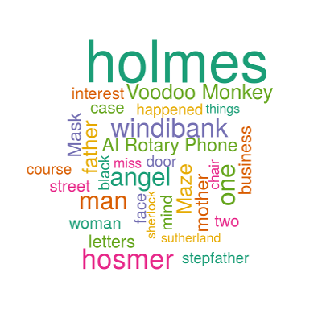

## Developing Data Products Assignment Week 4
John Hopkins Coursera Data Science Specialization 

## Sherlock Holmes Word Cloud

  - A fun app to create word clouds from Sherlock Holmes stories.
  - Select a single story or multiple stories
  - Input custom words
  - Adjust the frequency of the words displayed   
  - Adjust the maximum number of words displayed 
  
  The presentation is at https://mickguy.github.io/ddp-week4/#/   
  The shiny app is at https://mickguy.shinyapps.io/miningsherlock/